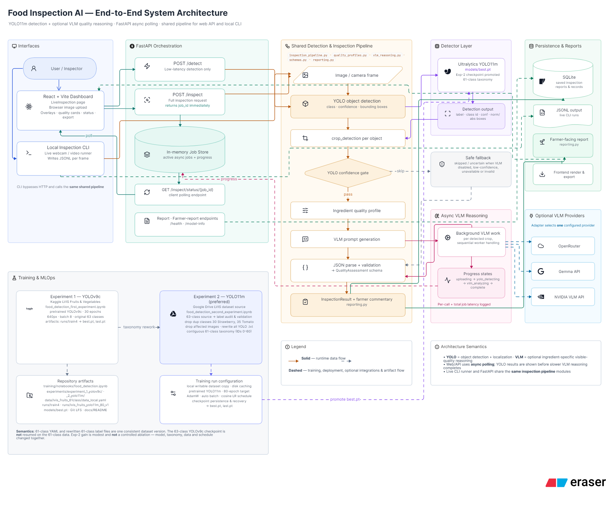

# Food Inspection AI

Food Inspection AI is an end-to-end computer-vision system for detecting fruits and vegetables and assessing their visible quality. It combines a YOLO detector, optional vision-language reasoning, a FastAPI backend, a React/TypeScript frontend, local report persistence, and live camera/CLI workflows.

## System architecture



*Food Inspection AI end-to-end system architecture.*

The runtime flow is deliberately split into two stages. YOLO performs fast object detection and localization. The optional VLM stage receives eligible object crops, evaluates ingredient-specific quality dimensions, and returns structured quality information. The API uses background jobs and polling for full inspection so that slower external VLM calls do not block the original upload request.

## Detection and model training

The deployed detector is the **YOLO11m model from Experiment 2**, loaded from [`models/best.pt`](models/best.pt). Its processed dataset uses 61 contiguous classes after removing two duplicate-case source classes and rewriting the YOLO annotation files to match the new class indexes.

The repository preserves both experiments, including their notebooks and `best.pt`/`last.pt` checkpoints:

| Experiment | Model | Dataset/training summary |
|---|---|---|
| Experiment 1 | YOLOv9c | Original 63-class baseline, 30 epochs, 640px input, batch size 8 |
| Experiment 2 | YOLO11m | Audited and reindexed 61-class dataset, explicit AdamW, automatic batch sizing, cosine learning-rate decay, 80-epoch target |

The complete notebooks, weights, dataset manifest, run artifacts, parameter tables, preprocessing logic, label reindexing explanation, metrics, and reproducibility instructions are in [`training/README.md`](training/README.md).

## Backend

The backend is implemented in Python and FastAPI. Its central runtime path is:

```text
Image upload or camera frame
        ↓
YOLO detection
        ↓
Detection objects: class, confidence, bounding box
        ↓
Crop each detected object
        ↓
Optional confidence gate
        ↓
Ingredient-specific quality profile
        ↓
Optional VLM reasoning
        ↓
Validated QualityAssessment
        ↓
Farmer commentary and InspectionResult
        ↓
API response, SQLite report, JSONL output, or live overlay
```

The main backend capabilities are:

| Capability | Implementation |
|---|---|
| Detection-only API | `POST /detect` |
| Full quality inspection | `POST /inspect` with asynchronous job polling |
| Job status | `GET /inspect/status/{job_id}` |
| Report history | SQLite-backed `/reports` endpoints |
| Structured contract | Pydantic models in `backend/schemas.py` |
| Detection and VLM orchestration | `backend/inspection_pipeline.py` |
| Ingredient-specific metrics | `backend/quality_profiles.py` |
| VLM provider adapters | `backend/vlm_reasoning.py` |
| Farmer-facing summaries | `backend/reporting.py` |
| Shared camera/video runner | `backend/live_inspection.py` |
| Detection-only CLI | `backend/live_inference.py` |
| Tracking-aware live CLI | `backend/main.py` |
| Provider benchmark | `backend/vlm_benchmark.py` |

The detailed backend explanation is maintained separately in the slow-motion learning guide: [`backend_slow_motion_guide.md`](backend_slow_motion_guide.md).

## Frontend

The frontend is a React and TypeScript dashboard located under [`frontend/`](frontend/). It provides the user-facing inspection workflow and consumes the backend contracts rather than implementing a second inference pipeline.

| Frontend area | Responsibility |
|---|---|
| `client/src/pages/LiveInspection.tsx` | Uploads images, selects inspection mode, displays progress, overlays, quality status, and item results |
| `client/src/api/inspectionApi.ts` | Sends multipart requests, polls asynchronous jobs, retrieves reports, summaries, and exports |
| `client/src/api/client.ts` | Configures the API base URL, timeout, and normalized errors |
| `client/src/hooks/useInspection.ts` | Coordinates loading, result, stage, and error state |
| `client/src/components/inspection/` | Renders bounding boxes, detection cards, confidence bars, and status badges |
| `client/src/pages/Dashboard.tsx` | Displays persisted inspection statistics |
| `client/src/pages/Reports.tsx` | Searches, filters, reviews, and exports saved inspections |
| `client/src/pages/ModelInfo.tsx` | Displays deployed model metadata returned by `/model-info` |
| `client/src/types/inspection.ts` | Mirrors backend result and reporting contracts in TypeScript |

## Repository structure

```text
.
├── backend/                    # FastAPI, inference, VLM, persistence, and CLIs
├── frontend/                   # React/TypeScript dashboard
├── models/
│   └── best.pt                # Deployed Experiment 2 YOLO11m checkpoint
├── training/                   # Both experiments, notebooks, weights, data, and metrics
├── runtime_artifacts/          # Local uploads, SQLite database, snapshots, and JSONL logs
├── docs/
│   ├── assets/architecture.png # System architecture diagram
│   ├── report.typ              # Report placeholder
│   └── presentation.typ        # Presentation placeholder
├── requirements.txt
└── README.md
```

## Running the project

### Backend

```bash
python -m venv .venv
source .venv/bin/activate
pip install -r requirements.txt
uvicorn backend.api:app --host 0.0.0.0 --port 8000 --reload
```

The detector-only endpoint requires no VLM key:

```bash
curl -X POST http://localhost:8000/detect \
  -F "file=@path/to/image.jpg"
```

Full inspection uses the configured VLM provider. The current default API path uses OpenRouter:

```bash
export OPENROUTER_API_KEY=your_key_here
curl -X POST "http://localhost:8000/inspect?confidence_gate=0.4" \
  -F "file=@path/to/image.jpg"
```

### Frontend

```bash
cd frontend
pnpm install
pnpm dev
```

The frontend uses `VITE_API_BASE_URL`, defaulting to `http://localhost:8000`.

### Local CLI workflows

Detection-only webcam, video, or image inference:

```bash
python -m backend.live_inference
python -m backend.live_inference --source path/to/image.jpg
python -m backend.live_inference --source path/to/video.mp4 --conf 0.4
```

Shared-pipeline live inspection:

```bash
python -m backend.live_inspection --source 0 --vlm-backend openrouter --display
```

The richer tracking-aware CLI is available through `backend.main`. Press `q` or `Esc` to exit live windows; press `s` to save snapshots and JSON output.

## API endpoints

| Method | Endpoint | Purpose |
|---|---|---|
| `GET` | `/health` | Service and model health |
| `POST` | `/detect` | YOLO-only image detection |
| `POST` | `/inspect` | Submit full asynchronous inspection |
| `GET` | `/inspect/status/{job_id}` | Poll inspection job state |
| `GET` | `/reports` | List persisted inspections |
| `GET` | `/reports/summary` | Dashboard aggregates |
| `GET` | `/reports/export` | Export saved reports as JSON |
| `GET` | `/reports/{report_id}` | Retrieve one inspection |
| `GET` | `/reports/{report_id}/farmer-report` | Retrieve inspection and farmer summary |
| `GET` | `/model-info` | Deployed model and training metadata |

## Current limitations

The active inspection job store is process-local and disappears when the API restarts. It is suitable for the current prototype but should be replaced with durable shared job storage for multi-worker production deployment. CORS is intentionally permissive for development and should be restricted before public deployment. Detector quality claims should be based on a locked independent test split with per-class metrics, threshold analysis, leakage checks, and target-hardware latency measurements.

## References

[1]: https://docs.ultralytics.com/modes/train/ "Ultralytics training mode documentation"
[2]: https://docs.ultralytics.com/tasks/detect/ "Ultralytics object detection documentation"
[3]: https://fastapi.tiangolo.com/tutorial/background-tasks/ "FastAPI background tasks documentation"
[4]: https://fastapi.tiangolo.com/tutorial/request-files/ "FastAPI file upload documentation"
[5]: https://docs.pydantic.dev/latest/ "Pydantic documentation"
[6]: https://www.lvisdataset.org/ "LVIS dataset project"
